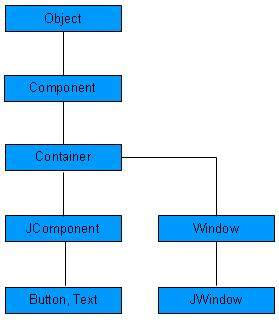

# SWING - 控件

每个用户界面考虑有以下三个主要方面：

- **UI 元素**： 有用户最终看到并且与之交互的核心视觉元素。GWT 提供了一个大量的广泛使用和常见的元素列表，本教程我们将涉及从基本到复杂的变化。

- **布局**： 他们定义应该如何在屏幕上组织 UI 元素，并且提供一个最终的外观和风格给 GUI（图形用户界面）。这部分将在布局这一章涉及。

- **行为**： 当用户与 UI 元素交互时，这些事件发生。这部分将在事件处理这一章涉及。

每个 SWING 控件从下列组件类的等级继承属性。

<table class="table table-bordered">
<tr><th class="fivepct">序号</th><th>类 & 描述</th></tr>
<tr><td>1</td><td><b>Component</b> Container 是 SWING 的非菜单用户界面控件的一个抽象基类。组件代表一个用图形表示的对象</td></tr>
<tr><td>2</td><td><b>Container</b> Container 是一个组件，它可以包含其他 SWING 组件。</td></tr>
<tr><td>3</td><td><b>JComponent</b> JComponent 是一个所有 swing UI 组件的基类。为了使用继承自 JComponent 的一个 swing 组件，组件必须是一个包容层次结构，它的根是一个顶层的 Swing 容器。</td></tr>
</table>

## SWING UI 元素:

下列是当使用 SWING 来设计 GUI 时常用的控件列表。

<table class="table table-bordered">
<tr><th class="fivepct">Sr. No.</th><th>控件 & 描述</th></tr>
<tr><td>1</td><td><b>JLabel</b> JLabel 对象是一个在容器中放置文本的组件。</td></tr>
<tr><td>2</td><td><b>JButton</b> 该类创建一个有标签的的按钮。</td></tr>
<tr><td>3</td><td><b>JColorChooser</b> JColorChooser 提供一个控制面板，设计允许用户操作和选择颜色。</td></tr>
<tr><td>4</td><td><b>JCheck Box</b> JCheckBox 是一个图形化的组件，它的状态要么是 <b>on</b>（true）要么是 <b>off</b>（false）。</td></tr>
<tr><td>5</td><td><b>JRadioButton</b> JRadioButton 类是一个图形化的组件，在一个组中，它的状态要么是 <b>on</b>（true）要么是<b>off</b>（false）。</td></tr>
<tr><td>6</td><td><b>JList</b> JList 组件呈现给用户一个滚动的文本项列表。</td></tr>
<tr><td>7</td><td><b>JComboBox</b> JComboBox 组件呈现给用户一个显示菜单的选择。</td></tr>
<tr><td>8</td><td><b>JTextField</b> JTextField 对象是一个文本组件，它允许编辑单行文本。</td></tr>
<tr><td>9</td><td><b>JPasswordField</b> JPasswordField  对象是一个专门用于密码输入的文本组件。</td></tr>
<tr><td>10</td><td><b>JTextArea</b> JTextArea 对象是一个文本组件，它允许编辑多行文本。</td></tr>
<tr><td>11</td><td><b>ImageIcon</b> ImageIcon 控件是一个图标界面的实现，它从图像描绘图标</td></tr>
<tr><td>12</td><td><b>JScrollbar</b> Scrollbar 控件代表一个滚动条组件，为了让用户从值的范围中选择。</td></tr>
<tr><td>13</td><td><b>JOptionPane</b> JOptionPane 提供了一组提示用户输入值的标准对话框，或者通知他们其他东西。</td></tr>
<tr><td>14</td><td><b>JFileChooser</b> JFileChooser 控件代表一个对话框窗口，用户可以从该对话框窗口选择一个文件。</td></tr>
<tr><td>15</td><td><b>JProgressBar</b> 随着任务完成的进展，进度条显示任务完成的百分比。</td></tr>
<tr><td>16</td><td><b>JSlider</b> JSlider 让用户在有界区间内通过滑动旋钮图形化地选择一个值。</td></tr>
<tr><td>17</td><td><b>JSpinner</b> JSpinner 是一个单行输入字段，它让用户从一个有序序列中选择一个数字或者一个对象值。</td></tr>
</table>
