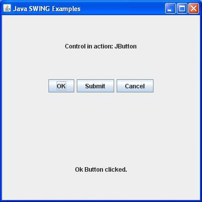

# SWING 事件处理

## 什么是事件？

改变对象的状态被称为事件，即事件描述源的状态变化。事件产生用户与图形用户界面组件交互的结果。例如，点击一个按钮，移动鼠标，通过键盘输入一个字符，从列表中选择一个项目，滚动页面都是导致一个事件发生的活动。

##事件的类型

事件可以大致分为两类:：

- **前台事件** - 这些事件需要用户的直接互动。它们是由在图形用户界面中人与图形组件交互的结果而产生的。例如，点击一个按钮，移动鼠标，通过键盘输入一个字符，从列表中选择一个项目，滚动页面等。

- **后台事件** - 这些事件需要最终用户的交互，它们被称为后台事件。操作系统的中断，硬件或软件故障，计时器过期，操作完成都是后台事件的例子。

## 什么是事件处理？

事件处理是一种机制，如果一个事件发生时，它控制该事件，并且决定应该会发生什么。这种机制具有被称为事件处理程序的代码，当一个事件发生时，它是可执行的。Java 使用代理事件模型来处理事件。该模型定义了标准的机制来生成和处理事件。让我们来简要介绍这个模型。

代理事件模型具有下列主要参与者，即：

- **源** - 源是一个对象，事件发生在该对象上。源负责提供发生事件的信息给它的处理器。Java 提供源对象的类。

- **监听器** - 它也被称为作为事件处理。监听器负责产生对一个事件的响应。从 java 实现的角度来看，监听器也是一个对象。监听器等待直到它接收到一个事件。一旦收到该事件，监听器进程的事件就返回。

这种方法的好处是，用户界面逻辑完全从生成事件的逻辑中分开。用户界面元素能够把事件的处理委派给一段单独的代码。在这个模型中，监听器需要用源对象注册，以便监听器能够接收事件通知。这是一个有效的处理事件的方式，因为这些事件通知只发送给那些想要接收它们的监听器。

## 事件处理所涉及的步骤

- 用户单击按钮，然后生成事件。

- 现在有关事件类的对象是自动创建的，源和事件的信息在同一对象得到填充。

- 事件对象被转发到注册监听器类的方法中。

- 该方法现在得到执行并且返回。

##　有关监听器要记住的要点

- 为了设计一个监听器类，我们必须开发一些监听器接口。这些监听器接口预测一些公共的抽象回调方法，这些方法必须由监听器类来实现。

- 如果你没有实现任何预定义的接口，那么你的类不能作为源对象的监听器类。

## 回调方法

这些方法由 API 提供者来提供，由应用程序员来定义，并且由应用程序开发者来调用。这里的回调方法代表一个事件方法。响应一个事件 java jre 将触发回调方法。所有这些回调方法在监听器接口中被提供。

如果一个组件需要一些监听器监听它的事件，源必须自己注册给监听器。

## 事件处理例子

使用你选择的任何编辑器创建下面的 java 程序，在 **D:/ > SWING > com > tutorialspoint > gui >**

*SwingControlDemo.java*

```
package com.tutorialspoint.gui;
import java.awt.*;
import java.awt.event.*;
import javax.swing.*;
public class SwingControlDemo {
   private JFrame mainFrame;
   private JLabel headerLabel;
   private JLabel statusLabel;
   private JPanel controlPanel;
   public SwingControlDemo(){
      prepareGUI();
   }
   public static void main(String[] args){
      SwingControlDemo swingControlDemo = new SwingControlDemo();  
      swingControlDemo.showEventDemo();       
   }      
   private void prepareGUI(){
      mainFrame = new JFrame("Java SWING Examples");
      mainFrame.setSize(400,400);
      mainFrame.setLayout(new GridLayout(3, 1));
      headerLabel = new JLabel("",JLabel.CENTER );
      statusLabel = new JLabel("",JLabel.CENTER);        
      statusLabel.setSize(350,100);
      mainFrame.addWindowListener(new WindowAdapter() {
         public void windowClosing(WindowEvent windowEvent){
	        System.exit(0);
         }        
      });    
      controlPanel = new JPanel();
      controlPanel.setLayout(new FlowLayout());
      mainFrame.add(headerLabel);
      mainFrame.add(controlPanel);
      mainFrame.add(statusLabel);
      mainFrame.setVisible(true);  
   }
   private void showEventDemo(){
      headerLabel.setText("Control in action: Button"); 
      JButton okButton = new JButton("OK");
      JButton submitButton = new JButton("Submit");
      JButton cancelButton = new JButton("Cancel");
      okButton.setActionCommand("OK");
      submitButton.setActionCommand("Submit");
      cancelButton.setActionCommand("Cancel");
      okButton.addActionListener(new ButtonClickListener()); 
      submitButton.addActionListener(new ButtonClickListener()); 
      cancelButton.addActionListener(new ButtonClickListener()); 
      controlPanel.add(okButton);
      controlPanel.add(submitButton);
      controlPanel.add(cancelButton);       
      mainFrame.setVisible(true);  
   }
   private class ButtonClickListener implements ActionListener{
      public void actionPerformed(ActionEvent e) {
         String command = e.getActionCommand();  
         if( command.equals( "OK" ))  {
            statusLabel.setText("Ok Button clicked.");
         }
         else if( command.equals( "Submit" ) )  {
            statusLabel.setText("Submit Button clicked."); 
         }
         else  {
            statusLabel.setText("Cancel Button clicked.");
         }  	
      }		
   }
}
```

使用命令提示符编译该程序。转到 **D:/ > SWING** 并输入下面的命令。

```
D:\AWT>javac com\tutorialspoint\gui\SwingControlDemo.java
```

如果没有错误出现，就意味着编译成功。使用下面的命令来运行程序。

```
D:\AWT>java com.tutorialspoint.gui.SwingControlDemo
```

验证下面的输出


