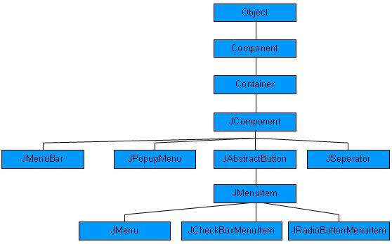

# SWING 菜单类

正如我们所知道每个顶层窗口有一个菜单栏与它相关联。这个菜单栏包括各种菜单可用的选择给最终用户。而且每个选择包含被称为下拉菜单的选项列表。菜单和菜单项的控件都是 MenuComponent 类的子类。

## 菜单层次结构

## 菜单控件

<table class="table table-bordered">
<tr><th class="fivepct">Sr. No.</th><th>控件 & 描述</th></tr>
<tr><td>1</td><td><b>JMenuBar</b> JMenuBar 对象是与顶层窗口相关联的</td></tr>
<tr><td>2</td><td><b>JMenuItem</b> 菜单中的项目必须属于 JMenuItem 或任何它的子类。</td></tr>
<tr><td>3</td><td><b>JMenu</b> JMenu 对象是从菜单栏中显示的一个下拉菜单组件。</td></tr>
<tr><td>4</td><td><b>JCheckBoxMenuItem</b> JCheckBoxMenuItem 是 JMenuItem 的子类。</td></tr>
<tr><td>5</td><td><b>JRadioButtonMenuItem</b> JRadioButtonMenuItem 是 JMenuItem 的子类。</td></tr>
<tr><td>6</td><td><b>JPopupMenu</b> JPopupMenu 可以在一个组件内的指定位置动态地弹出。</td></tr>
</table>

